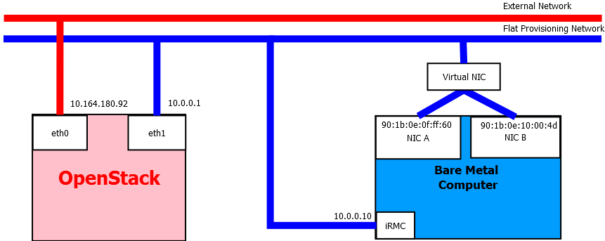
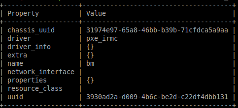
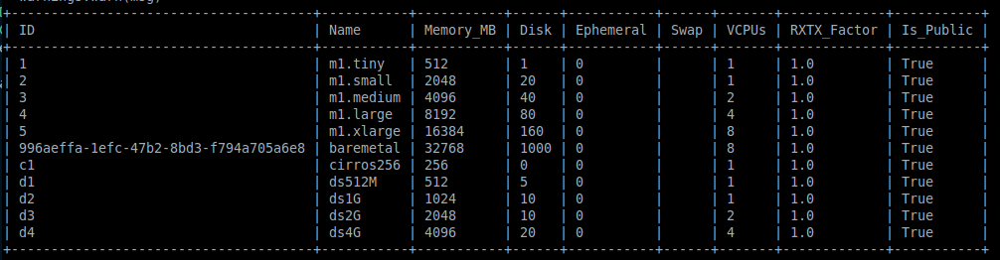
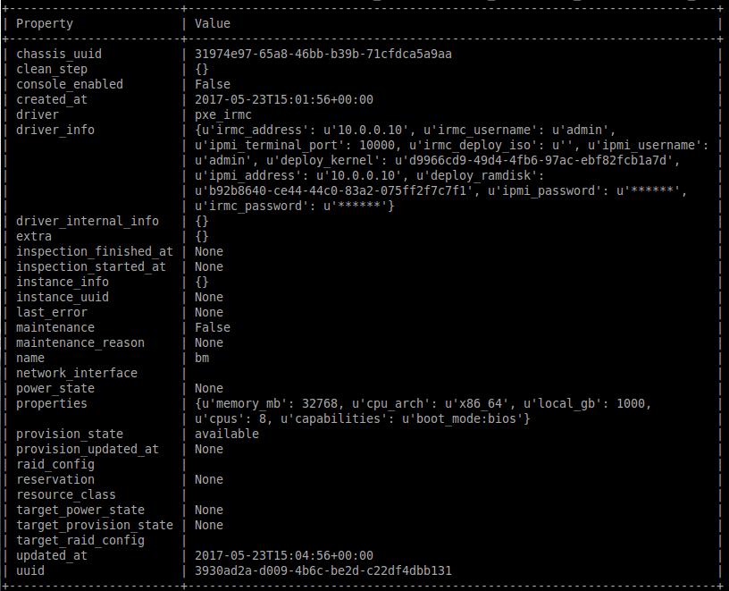
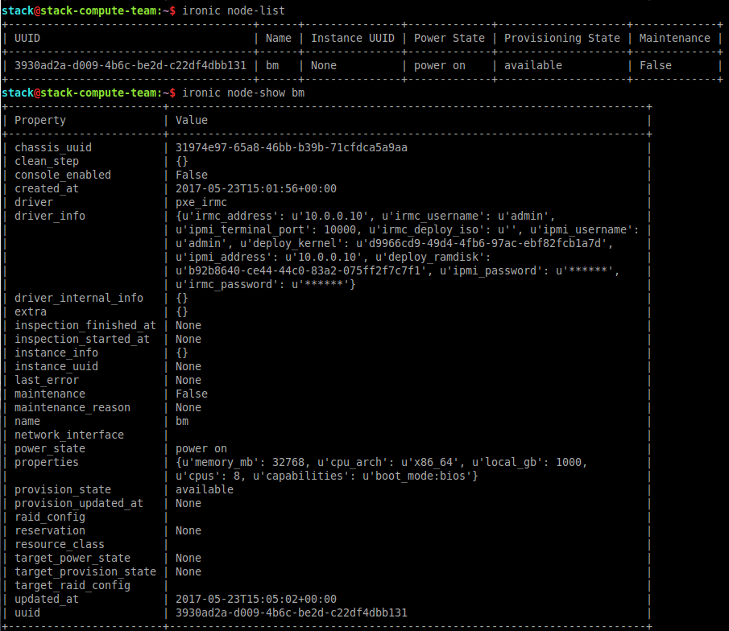
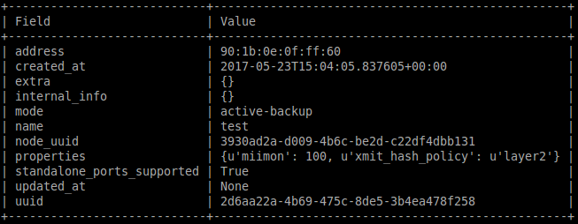
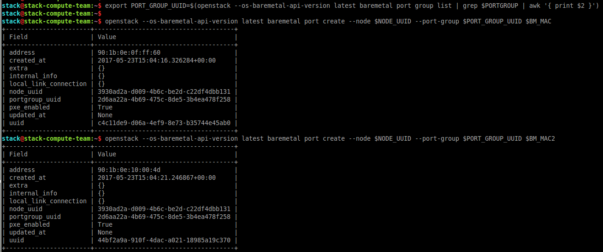
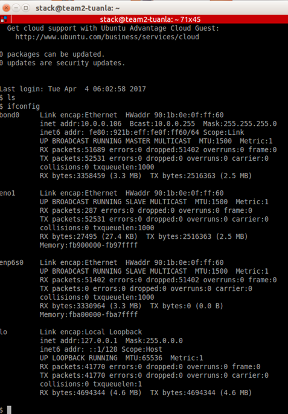

# High availability of Bare Metal: Link Aggressive support in Linux with Fujitsu Server

## 1. Introduction ironic port groups support

The Bare Metal Service (ironic) [3] supports static configuration of **port groups** (PG) will allow user to increase performance or provide higher reliability of network connection. PG can be called as bonds in Linux or NIC Teaming in Windows. Nova using configdrive [1] to allow utilize NIC aggregation when instance is spawned on hardware server. For Linux bare metal computer (BM), see kernel documentation on bonding [2] for more detail and how it is setup in Linux.

This tutorial will show how to create bare metal computer (BM) with port groups support follow the network prototype here:



Figure 1: Network prototype of Bare Metal Provisioning

The requirement for tutorial include two computer:

- OpenStack Computer: Ubuntu and OpenStack with enable Ironic service
- Bare Mental Computer (BM): Server support IPMI Tool such as Fujitsu TX2540 M1 Server.

## 2. Configuring and enabling pxe\_irmc driver of Fujitsu PRIMERGY Server

The Bare Metal service is a collection of components that provides support to manage and provision physical machines [3]. Also known as the ironic project, The Bare Metal service includes the following components: ironic-api, ironic-conductor, ironic-python-agent [4]. We will Deploy Ironic with DevStack. DevStack may be configured to deploy Ironic, setup Nova to use the Ironic driver and provide hardware resources (network, bare metal compute nodes) using a combination of OpenVSwitch and libvirt. It is highly recommended to deploy on an expendable virtual machine and not on your personal work station. Deploying Ironic with DevStack requires a machine running Ubuntu 16.04 (or later) or Fedora 24 (or later). Make sure your machine is fully up to date and has the latest packages installed before beginning this process [5]. We recommend Bare Metal service installation guide [6] for more detail working setup Ironic.

Devstack will no longer create the user &#39;stack&#39; with the desired permissions, but does provide a script to perform the task:

>_$ git clone https://git.openstack.org/openstack-dev/devstack.git devstack_

>_$ sudo ./devstack/tools/create-stack-user.sh_

Switch to the stack user:

>_$ sudo su - stack_

Create devstack/local.conf with minimal settings required to enable Ironic. An example local.conf that enables both deploy in Fujitsu hardware and uses the pxe\_irmc driver by default:
```
[[local|localrc]]

SERVICE_TOKEN=fujitsu
ADMIN_PASSWORD=fujitsu
DATABASE_PASSWORD=fujitsu
RABBIT_PASSWORD=fujitsu
SERVICE_PASSWORD=$ADMIN_PASSWORD

enable_service n-cauth
enable_service n-cell
disable_service n-novnc
enable_service n-xvnc
enable_service n-sproxy
enable_service n-crt
enable_service q-svc
enable_service q-agt
enable_service q-dhcp
enable_service q-l3
enable_service q-meta
enable_service neutron
enable_service rabbit

disable_service n-net
disable_service tempest

# Enable Ironic plugin
enable_plugin ironic https://git.openstack.org/openstack/ironic
enable_plugin ironic-ui https://github.com/openstack/ironic-ui

# The parameters below represent the hardware specification of bare metal
IRONIC_HW_NODE_CPU=8
IRONIC_HW_NODE_RAM=32768
IRONIC_HW_NODE_DISK=1000
IRONIC_HW_EPHEMERAL_DISK=0

VIRT_DRIVER=ironic

IRONIC_IS_HARDWARE=True
IRONIC_BAREMETAL_BASIC_OPS=True
IRONIC_ENABLED_DRIVERS=agent_ipmitool,pxe_irmc
IRONIC_DEPLOY_DRIVER=pxe_irmc
IRONIC_IPXE_ENABLED=False
IRONIC_DEPLOY_DRIVER_ISCSI_WITH_IPA=True

MULTI_HOST=1
NETWORK_GATEWAY=10.0.0.1
HOST_IP=10.0.0.1
FIXED_RANGE=10.0.0.0/24
FIXED_NETWORK_SIZE=256

# Need change parameters to own local configuration present your external network and provison network
FLOATING_RANGE=10.164.180.100/28
PUBLIC_SUBNET_NAME=extnet1
Q_FLOATING_ALLOCATION_POOL=start=10.164.180.105,end=10.164.180.110
FLOATING_ALLOCATION_POOL=start=10.164.180.105,end=10.164.180.110
PUBLIC_NETWORK_GATEWAY=10.164.180.65
IP_VERSION=4
PUBLIC_NETWORK_NAME=public
PHYSICAL_NETWORK=private
PUBLIC_PHYSICAL_NETWORK=public
PUBLIC_INTERFACE=eth1
OVS_PHYSICAL_BRIDGE=br-eth1
Q_USE_PROVIDER_NETWORKING=True
Q_USE_PROVIDERNET_FOR_PUBLIC=True
PUBLIC_BRIDGE=br-ex
PROVIDER_NETWORK_TYPE=flat
PROVIDER_SUBNET_NAME=sharednet1
ALLOCATION_POOL=start=10.0.0.100,end=10.0.0.200
USE_SUBNETPOOL=True

ENABLE_ISOLATED_METADATA=True
ENABLE_METADATA_NETWORK=True
ENABLE_TENANT_TUNNELS=False
ENABLE_TENANT_VLANS=False

Q_PLUGIN=ml2
Q_ML2_PLUGIN_TYPE_DRIVERS=flat
Q_ML2_TENANT_NETWORK_TYPE=flat
Q_ML2_PLUGIN_MECHANISM_DRIVERS=openvswitch
ML2_VLAN_RANGES=private,public
Q_ML2_PLUGIN_FLAT_TYPE_OPTIONS=flat_networks=private,public

Q_ML2_PLUGIN_FLAT_NETWORKS=private,public
Q_ML2_PLUGIN_FLAT_RANGE=private,public
ML2_FLAT_RANGES=private,public

Q_USE_SECGROUP=True
OVS_BRIDGE_MAPPINGS=private:br-eth1

[[post-config|$NOVA_CONF]]
[DEFAULT]
compute_manager=ironic.nova.compute.manager.ClusteredComputeManager
scheduler_available_filters=nova.scheduler.filters.all_filters
scheduler_use_baremetal_filters=True
scheduler_tracks_instance_changes=False

[serial_console]
enabled = True
base_url=ws://10.0.0.1:6083/
serialproxy_host = 10.0.0.1
proxyclient_address=10.0.0.1

[vnc]
enabled = false

[[post-config|$IRONIC_CONF_FILE]]
[DEFAULT]
my_ip = 10.0.0.1
[conductor]
deploy_callback_timeout = 0

[pxe]
pxe_append_params = nofb nomodeset vga=normal console=tty0 console=ttyS0,9600n8


```

## 3. Enroll Fujitsu PRIMERGY Server in Bare Metal service

After all the Bare Metal services have been properly configured, you should enroll your hardware with the Bare Metal service, and confirm that the Compute service sees the available hardware. The nodes will be visible to the Compute service once they are in the available provision state [7].  This section describes the main steps to enroll a node and make it available for provisioning. Some steps are shown separately for illustration purposes, and may be combined if desired.

- Create a bare metal computer (BM) in the Bare Metal service

>$ ironic node-create -d pxe\_irmc -n bm



- Update the node driver\_info so that Bare Metal service can manage the BM

>$ ironic node-update bm add driver\_info/ipmi\_username=$IRMC\_USERNAME driver\_info/ipmi\_password=$IRMC\_PASSWORD driver\_info/ipmi\_address=$IRMC\_IP driver\_info/irmc\_username=$IRMC\_USERNAME driver\_info/irmc\_password=$IRMC\_PASSWORD driver\_info/irmc\_address=10.0.0.10 driver\_info/ipmi\_terminal\_port=10000

- Update the BM&#39;s properties to match the bare metal flavor

>$ nova flavor-list




>$ ironic node-update bm add properties/memory\_mb=&#39;32768&#39; properties/cpu\_arch=&#39;x86\_64&#39; properties/local\_gb=$MEMMORY properties/cpus=&#39;8&#39;

>$ ironic node-update $NODE\_UUID add properties/capabilities=&#39;boot\_mode:bios&#39;


- Specify a deploy kernel and ramdisk which correspond to the BM&#39;s driver

> $ export DEPLOY\_KERNEL=$(glance image-list | grep ir-deploy-pxe\_irmc.kernel | awk &#39;{ print $2 }&#39;)

> $ export DEPLOY\_RAMDISK=$(glance image-list | grep ir-deploy-pxe\_irmc.initramfs | awk &#39;{ print $2 }&#39;)

> $ ironic node-update bm add driver\_info/deploy\_ramdisk=$DEPLOY\_RAMDISK driver\_info/deploy\_kernel=$DEPLOY\_KERNEL



- Validate BM

>$ ironic node-validate bm

>$ ironic node-list

>$ ironic node-show bm





## 4. Port groups configuration in the Bare Metal service

You can look at Port groups support [8] for more detail how to setup configuration of port groups (bonds) in the BM. Port group configuration is supported in ironic API microversions 1.26. You can update  ironic API microversions by install newest version of python-ironicclient [10].  The CLI commands a tutorial for setup port group support on Fujitsu server:

- Creating a port group

>$ openstack --os-baremetal-api-version latest baremetal port group create --address   90:1b:0e:0f:ff:60 --node bm --name test --mode active-backup --property miimon=100 --property xmit\_hash\_policy=&quot;layer2&quot; --support-standalone-ports



- Associate ports with the created port group

>$ export PORT\_GROUP\_UUID=$(openstack --os-baremetal-api-version latest baremetal port group list | grep test | awk &#39; {print $2}&#39;)

>$ openstack --os-baremetal-api-version latest baremetal port create --node bm --port-group $PORT\_GROUP\_UUID 90:1b:0e:0f:ff:60

>$ openstack --os-baremetal-api-version latest baremetal port create --node bm --port-group  $PORT\_GROUP\_UUID 90:1b:0e:10:00:4d




- Boot an instance (or node directly, in case of using standalone ironic) providing an image (section 5) that has cloud-init version 0.7.7 or later and supports bonding [8]. This is configuration after deploy BM:



## 5. Create Ubuntu Images supports bonding.

There are several tools that are designed to automate image creation. We used Diskimage-builder [9], which is an automated disk image creation tool that supports a variety of distributions and architectures. Diskimage-builder (DIB) can build images for Fedora, Red Hat Enterprise Linux, Ubuntu, Debian, CentOS, and openSUSE, to create Ubuntu image for provisioning on BM. This is script we used to create Ubuntu image:

>$ export IMAGE\_NAME=ubuntu-cloud-image

>$ export DIB\_DEV\_USER\_USERNAME=devuser

>$ export DIB\_DEV\_USER\_PASSWORD=abc123

>$ export DIB\_DEV\_USER\_PWDLESS\_SUDO=Yes

>$ export DIB\_CLOUD\_INIT\_DATASOURCES=&quot;ConfigDrive, OpenStack&quot;

>$ disk-image-create ubuntu vm devuser cloud-init-datasources -o $IMAGE\_NAME


## 6. References

[1] [https://docs.openstack.org/user-guide/cli-config-drive.html](https://docs.openstack.org/user-guide/cli-config-drive.html)

[2] [https://www.kernel.org/doc/Documentation/networking/bonding.txt](https://www.kernel.org/doc/Documentation/networking/bonding.txt)

[3] [https://docs.openstack.org/project-install-guide/baremetal/ocata/](https://docs.openstack.org/project-install-guide/baremetal/ocata/)

[4] [https://docs.openstack.org/project-install-guide/baremetal/ocata/get_started.html](https://docs.openstack.org/project-install-guide/baremetal/ocata/get-started.html)

[5] [https://docs.openstack.org/developer/ironic/dev/dev-quickstart.html](https://docs.openstack.org/developer/ironic/dev/dev-quickstart.html)

[6] [https://docs.openstack.org/project-install-guide/baremetal/ocata/](https://docs.openstack.org/project-install-guide/baremetal/ocata/)

[7] [https://docs.openstack.org/project-install-guide/baremetal/ocata/enrollment.html](https://docs.openstack.org/project-install-guide/baremetal/ocata/enrollment.html)

[8] [https://docs.openstack.org/developer/ironic/ocata/deploy/portgroups.html](https://docs.openstack.org/developer/ironic/ocata/deploy/portgroups.html)

[9] [https://docs.openstack.org/image-guide/create-images-automatically.html#diskimage-builder](https://docs.openstack.org/image-guide/create-images-automatically.html#diskimage-builder)

[10] [https://pypi.python.org/pypi/python-ironicclient](https://pypi.python.org/pypi/python-ironicclient)
