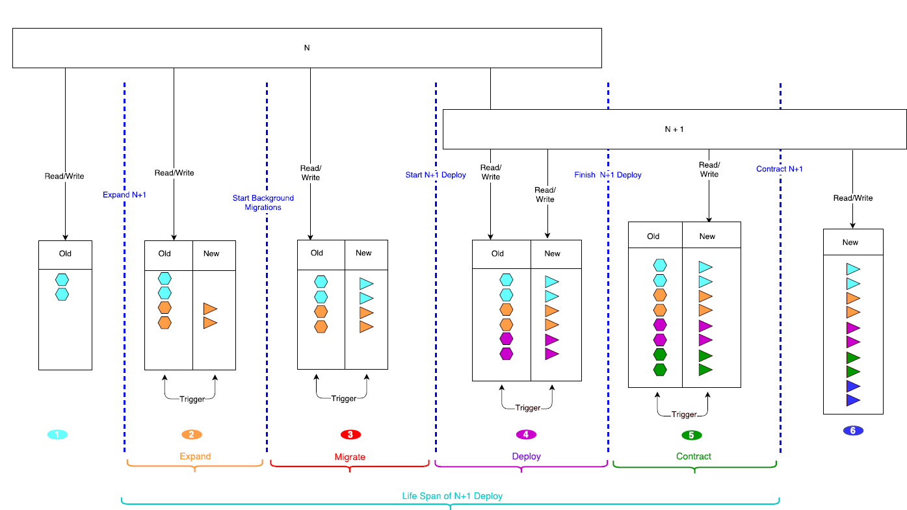

## Rolling-Upgrade [Part 2]

Trong phần tiếp theo của chủ đề **Rolling upgrade** tôi sẽ phân tích về tám tính năng [1] mà một project bất kỳ cần phải implement để có tính năng Rolling upgrade.

--------------------------------

### 1. Online Schema Migration
Cho phép thay đổi lược đồ cơ sở dữ liệu mà **không** yêu cầu tắt hết dịch vụ (không hỗ trợ thay đổi về phiên bản cũ hơn).
Lược đồ cơ sở dữ liệu ở đây ta có thể hiểu là database của một service. Hãy thử hình dung rằng trong phiên bản kế tiếp database đã bị thay đổi như thêm cột/bảng, xóa cột/bảng, hoặc sửa lại tên cột/bảng. Vậy làm thế nào mà ta có thể upgrade database lên phiên bản kế tiếp mà không cần tắt hết các service. Hiện tại, có hai lời giải cho bài toán này. Một là sử dụng tính năng trigger  hay còn gọi là `trigger-based` và hai là không sử dụng trigger gọi là `trigger-less`.

**Lời giải thứ nhất:** Sử dụng trigger (trigger-based).

Vậy `trigger` là gì: Trigger được hiểu đơn giản là một thủ tục được thực thi một cách tự động trong database khi có một sự kiện xảy ra như update, insert hay delete.
*Ví dụ*: ta có thể tạo ra một trigger để trước khi ghi một bản ghi vào trong table A thì phải update bản ghi có foreign-key tương ứng từ table B sang một giá trị khác.

Bây giờ tôi sẽ lấy một đầu bài và các bạn hãy **luôn nhớ** nó trong suốt quá trình đọc lời giải thứ nhất để có thể hiểu xuyên suốt nhé.

**Bài toán:** Database của một service tại phiên bản N có một bảng tên là "old" nhưng sang database tại phiên bản N+1 đã bị xóa và thay thế bằng bảng mới tên là "new". Vậy làm thế nào để người vận hành có thể upgrade database mà không cần phải tắt hết các service tương đương với việc các service vẫn có thể tương tác với database trong quá trình upgrade.

Sử dụng trigger là một trong những lời giải cho bài toán này và tôi sẽ phân tích từng giai đoạn để các bạn thấy được không có thời điểm nào có service xung đột với database.

Trong quá trình rolling upgrade database sử dụng trigger ta sẽ có 3 pha chính:
- Expand: dùng để thêm cột, bảng, trigger trong database.
- Migrate: dùng để di chuyển dữ liệu từ cũ sang mới.
- Contract: dùng để xóa cột, bảng, trigger trong database.

Giả sử có hai service (A và B) cùng tương tác với database:

Và quá trình upgrade database sử dụng trigger có các pha như sau:

- Pha (1): Chuẩn bị upgrade

Khi hai service (A và B) đang chạy tại phiên bản N thì chúng đều tương tác với "old" table.

- Pha (2): Expand database

Lúc này database sẽ có "new" table và trigger. Nếu trên A và B tạo ra các bản ghi ở "old" table thì trigger sẽ làm nhiệm vụ thay đổi nội dung của bản ghi đó cho phù hợp với "new" table rồi ghi vào trong "new" table.

Hình ngũ giác màu da cam thể hiện các dữ liệu được tạo ra tại pha expand, và hình tam giác màu da cam thể hiện các dữ liệu được tạo bởi trigger.

Hình ngũ giác màu xanh da trời thể hiện các dữ liệu đã có sẵn trước pha expand.

- Pha (3): Migrate database

Lấy toàn bộ dữ liệu ở "old" table trước thời điểm tạo trigger sau đó thay đổi thành dữ liệu phù hợp với "new" table. Nghĩa là tất cả các hình ngũ giác màu xanh da trời sẽ được ánh xạ thành hình tam giác tương ứng tại "new" table.

- Pha (4): Deploy

Nhờ có tính năng rolling upgrade mà ta không phải upgrade hai service cùng một thời điểm mà ta có thể làm lần lượt:

*Thời điểm 1:* Upgrade service A lên phiên bản (N+1):
A sẽ đọc ghi vào "new" table, và khi tạo ra một bản ghi mới ở "new" table thì cũng sẽ được trigger thay đổi phù hợp rồi ghi vào "old" table.
Đối với B thì vẫn đọc tại "old" table và nếu ghi vào "old" table thì cũng được trigger thực hiện tương tự sang "new" table.

*Thời điểm 2:* Upgrade service B lên phiên bản (N+1):
Lúc này tất cả các serivice đã được upgrade lên (N+1)

- Pha (5): Contract database

Sau khi đã upgrade toàn bộ service lên (N+1) thì "old" table sẽ không được đọc ghi bởi bất kì service nào nữa, tất cả đã chuyển sang đọc ghi "new" table.

Thực hiện contract phase sẽ xóa trigger và "old" table.

- Pha (6): Hoàn thành

Chúng ta đã hoàn thành quá trình upgrade hệ thống sử dụng trigger để xử lý vấn đề thay đổi database. Trong toàn bộ quá trình, service tại phiên bản N hay (N+1) cũng đều có thể tương tác với database, do vậy sẽ giảm được thời gian downtime hệ thống khi upgrade. Và hiện nay đã có Keystone và Glance trong Openstack đã sử dụng để upgrade database hay Facebook [2].

**Lời giải thứ hai:** Không sử dụng trigger (trigger-less).

Việc không sử dụng trigger thì database tại phiên bản N+1 cũng phải tương thích được với phiên bản N để khi upgrade database lên N+1 thì các service tại N vẫn có thể tương tác được. Vậy nên sẽ có một số rule được sinh ra trong việc upgrade dabase để đáp ứng được yêu cầu này. Và hiện nay đã có một số project trong Openstack như Nova, Neutron đang sử dụng lời giải này để upgrade database.

- *Rule 1:* Chỉ được thêm và không được xóa sửa cột hoặc bảng tại hai phiên bản kế tiếp (từ N lên N+1) và những cột/bảng đó default là None để xử lý trường hợp service cũ ghi vào database nhưng không có dữ liệu cho cột/bảng mới thì mặc định dữ liêu là None. Việc không được xóa sửa để đảm bảo cho việc service tại N luôn tương tác được với database tại N+1.
- *Rule 2:* Được phép xóa cột bảng của phiên bản N tại phiên bản N+1. Ví dụ như bảng A tại phiên bản N sẽ không được sử dụng tại phiên bản N+1 nhưng tại N+1 thì không được xóa bảng A mà phải chờ lên phiên N+2 mới được xóa bảng A.

Tiếp theo tôi sẽ phân tích tính năng thứ hai.

### 2. Maintenance Mode
Là chế độ đặt một service vào trạng thái duy trì, bảo hành sửa chữa để cho hệ thống không đặt resources trên node đó nữa khi có yêu cầu từ người dùng tạo mới resources. Cụ thể như Nova trong OpenStack đã áp dụng tính năng này.

Trong Nova có các thành phần như: nova-api, nova-conductor, nova-scheduler, nova-compute,...

Trong đó:
- nova-compute dùng để tạo ra các máy ảo, vậy máy ảo ở đây chính là resource.
- nova-scheduler sẽ làm nhiệm vụ tính toán để đặt con máy ảo trên nova-compute nào cho phù hợp.

Vậy câu chuyện là khi người vận hành muốn bảo trì một node nova-compute 30 thì đầu tiên họ phải ra lệnh cho nova kích hoạt chế độ **maintenance mode** cho node nova-compute 30 lên, lúc đó nova-scheduler sẽ không đặt việc tạo máy ảo trên node nova-compute 30 nữa kể cả tài nguyên trên node đó vẫn còn rất nhiều, khi có yêu cầu từ người dùng tạo máy ảo. Để người vận hành có thể thực hiện bảo trì với node nova-compute 30.
Đó chính là ý nghĩa của tính năng **Maintenance Mode**.

Trong bài tiếp theo, tôi sẽ tiếp tục phân tích về các tính chất còn lại của tám tính chất [1] trong Rolling upgrade.

- Live Migration
- Multi-version Interoperability
- Graceful Shutdown
- Upgrade Orchestration
- Upgrade Gating
- Project Tagging

Thân ái, hẹn gặp lại!
Nguyễn Hoài Nam - Vietnam OpenStack Community Organizer

[1] https://specs.openstack.org/openstack/openstack-user-stories/user-stories/proposed/rolling-upgrades.html#gaps
[2] https://www.facebook.com/notes/mysql-at-facebook/online-schema-change-for-mysql/430801045932/

