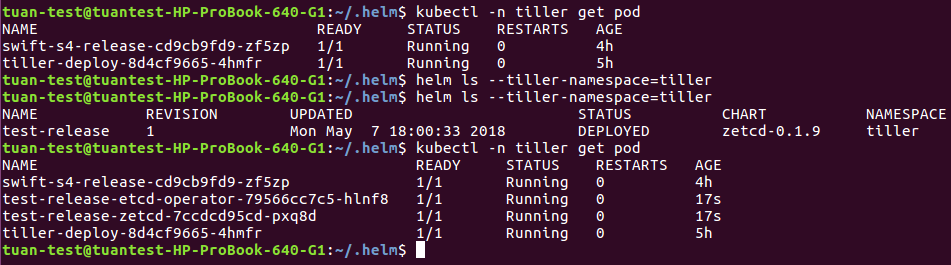
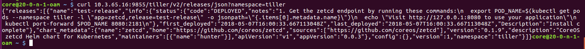

#### Case Study

- In CI/CD, there is a need to segregate users based on the purpose of deployment (e.g.testing, production).
- Based on the permitted access and isolation of micorservices, they should not be affected eachother from very beginning when it is deployed till running. Separation of namespace is a need.

We are going to use Helm to deploy microservices. By default, Helm will install Tiller server onto kube-system namespace. However, to match to above requirements, segregation of namespace for each microservice is needed and the solution is:

- Each microservice (MS) will have its own namespace (NS) with Tiller server running on. For instance, MS1 will run on NS1 where a Tiller server running on, MS2 will have NS2 where another Tiller server running on.

But... what if within NS1, MS1 should talk to Tiller to deploy something else but not using Helm CLI. This is because Tiller server will be deployed without using Helm CLI to ensure the security since Helm CLI has to use kubeconfig to connect to cluster and that kubeconfig is a vulnerable point. 

#### Solution

So, imagine that, there will be separate namespaces where separate Tillers which are deployed by not using Helm CLI are running on. On each namespace, Tiller should be accessed by microservices. Then what should we do now? Do we need to implement within each MS some modules to talk to Tiller via gRPC? IMHO, it will be quite complicating for developers doing it. Fortunately, Appscode created an opensource tool that will act as a gateway to Tiller. It is Appscode/Swift.

In order demonstrate this test, I set up myself a new User called "tiller" with RBAC, a new namespace called "tiller". On that namespace, i installed Tiller server as Deployment by using yaml file (not using Helm CLI) and Appscode/Swift. For more information about Appscode/Swift, check this link: https://appscode.com/products/swift/0.8.0/welcome/. I also install Helm CLI just for checking the result. 

Now, let's rock it on !!! Have a look to the Pic 1: 

Firstly, i have only 2 pods running which are swift and tiller server as well as there are no releases. Then i run the below command which send a request to swift to deploy a new release in the namespace "tiller":

curl 10.3.65.16:9855/tiller/v2/releases/test-release/json -X POST -d '{ "chart_url":"stable/zetcd", "namespace":"tiller"}'

The reponse is back in the Pic 2 as below:

Then have a look back to Pic 1 and we see that there exists now a new "test-release" which contains 2 pods.

As you can see that, Swift gets request and transfers request to Tiller, it acts as Tiller gateway. In this process, there is no Helm CLI.

Have fun !!!! 

Tutj/VietStack
