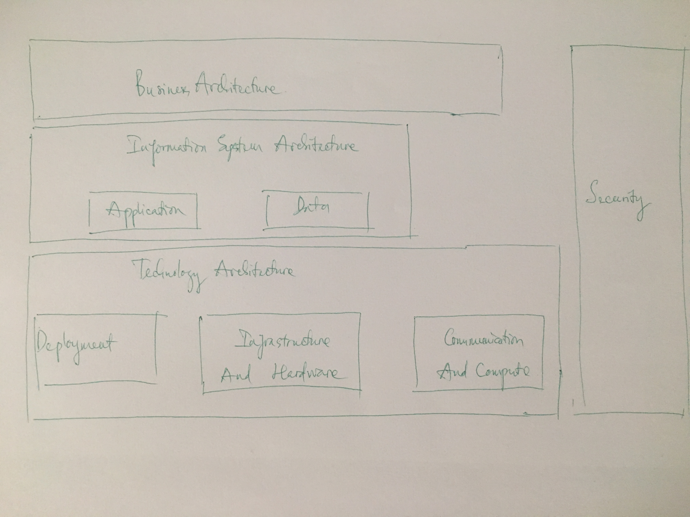

Tiếp theo part 2...

Tiếp theo phần 2, lẽ ra là mình định viết về các thách thức cũng như requirements của IR4, nhưng mà thôi, cái này cũng nhiều trên internet, các bạn tự kiếm nhé, ko thì có bạn lại bảo mình viết chả có gì mới :D. Thôi vậy thì ta bỏ qua phần "cũ" này đi, ta đi thẳng vào phần khá là "mới", đó chính architecture model của IR4.

Có rất nhiều reference mà ta có thể tham khảo về model kiến trúc của của IR4, đó là RAMI 4.0 (Reference Architectural Model Industrie 4.0) hoặc Industrial Internet Reference  Architecture (IIRA) from IIC (Industrial Internet Consortium), tuy nhiên trong nội dung bài viết này, mình sẽ follow theo TOGAF (The Open Group Architecture Framework). Các bạn hãy search google cho những keywords phía trên nếu các bạn ko hiểu nó là gì.

Vậy, bây giờ ta sẽ cùng xem đứng dưới góc độ kỹ thuật thì các use cases của IR4 sẽ phải được thiết kế như thế nào. Ta sẽ đi từ Architecture Building Blocks (ABB) để thấy được sự khái quát của nó về một kiến trúc, sau đó, từ kiến trúc khái quát ta sẽ đi vào Solution Building Block (SBB). Mục đích của ABB chính là cung cấp một định hướng trong một framework cụ thể và giúp chúng ta hiểu các concepts liên quan tới các framework đó cho từng use case cụ thể. Ở đây, ta sẽ chia ABB thành 3 domain, đó là: Business Architecture, Information System Architecture, Technology Architecture. Tuy nhiên, các building blocks này sẽ liên tục được cải tiến để phù hợp với các trào lưu và xu hướng công nghệ trong tương lai. Ví dụ,  trong một môi trường end-to-end, phân tán, dynamics và flexible thì ta cần phải lưu ý hơn đến các công nghệ tiên tiến, hỗ trợ theo từng domain. Với domain infrastructure thì SDN hay NFV cho phép việc triển khai một cách tối ưu hóa các network component dựa theo nhu cầu hoặc topology, với domian application and service thì khả năng tối ưu hóa về triển khai chính là việc áp ứng microservices, modularized app hoặc các orchestration framework như TOSCA. Ngoài ra ta có thể thấy một điều đặc biệt chính là Security sẽ được trải dài từ trên xuống dưới, bao trùm toàn bộ các domain.

(Sorry các bạn là hình mình vẽ vội bằng tay trong giờ họp nên ko được đẹp cho lắm, các bạn bỏ qua nhé :D).

T

VietStack/Tutj
