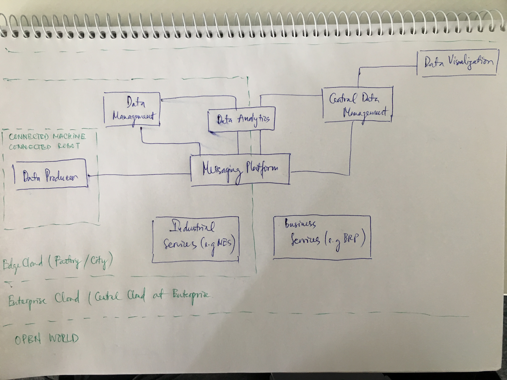
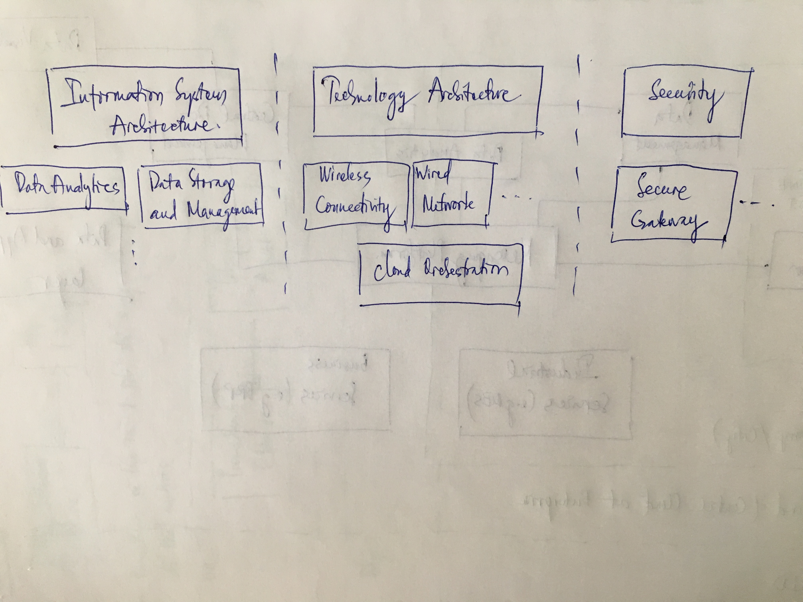

Tiếp theo phần 3, ở phần 4 này ta sẽ cùng nhau xem qua kiến trúc của 2 building block chính trong building block architecture ở phần 3, đó chính là "application and data" và "infrastructure tech".

 Ta có thể nhận thấy rằng, trong những năm gần đây khi ảo hóa ngày càng hoàn thiện thì việc sử dụng các computing resources trở nên tối ưu và hiệu quả hơn. Bên cạnh đó, các công nghệ lưu trữ sử dụng software defined đang được ứng dụng rộng rãi và đang dần thay thế một số phương pháp lưu trữ truyền thống cũ trong rất nhiều use cases. Tuy nhiên, để sử dụng các resources về computing cũng như lưu trữ giữa các phạm vi thì một trong những yêu cầu quan trọng trong cái nhìn tổng thể về infrastructure tech block chính là việc phá vỡ những rào cản về networking - sự kết nối của từng phạm vi thông qua network. Phạm vi ở đây chính là sự tách biệt về private/public, sự tách biệt về quy mô ứng dụng (enterprise, factory, etc.) và tùy từng phạm vi khác nhau thì các công nghệ khác nhau, hệ sinh thái khác nhau cũng như những business model khác nhau sẽ được áp dụng. Ở đây, ta sẽ cố gắng xóa bỏ rào cản này bằng việc kết nối chúng với nhau để ta có thể sử dụng resources của từng phạm vi một cách linh động và hiệu quả nhất. Các resources của các phạm vi sẽ hỗ trợ và hoạt động song song với nhau. Bên cạnh đó, công nghệ của phạm vi này cũng có thể áp dụng cho phạm vi kia, ví dụ như ảo hóa chẳng hạn. Để làm được việc này ta cần một network để kết nối toàn bộ các resource với nhau, trải dài từ public đến enterprise và cuối cùng là local. Qua đó ta có thể một nhìn nhận sự kết nối này sẽ tạo nên một cloud bao trùm toàn bộ các phạm vi.

Quay lại với block về "appliaction and data", ta cần phải giải quyết bài toán về data flow từ data producers, bài toán về data distribution giữa các ứng dụng của người dùng khác nhau cũng như data processing cho đến data visualization. Bên cạnh đó, việc khối lượng data ngày càng tăng thì quản trị data là vô cùng quan trọng. Quản trị có nghĩa là ta phải biết lưu trữ data tại đâu, transform nó khi cần thiết và lúc cần phải public nó. Ta có thể thấy ví dụ cụ thể ở đây trong phạm vị Smart Factory chính là sự xuất hiện của MES (Manufacturing Execution System) tại khía cạnh factory và ERP (Enterprise Resource Planning) tại khía cạnh doanh nghiệp. 

Refined Architecture Building Block là một khái niệm được định nghĩa rõ ràng hơn nữa dựa trên Architecture Building Block để phù hợp với từng yêu cầu của từng use case cụ thể. Nói một cách nôm na là khi ta đã có một khái niệm chung về Building Block thì tùy từng use case cụ thể thì ta dùng công nghệ gì, platform gì, etc. để phù hợp với tiêu chí của use case. Ví dụ trong Data Analytics của "Application and Data", trong usecase này ta cần phải có Big Data analytics hoặc Big Data batch processing nhưng trong usecase khác ta lại cần stream analytic.

Nói một cách ngắn gọn thì ta có thể có những cái nhìn về high-level của các block trong kiến trúc IR4. Lưu ý rằng, kiến trúc này luôn luôn thay đổi và tùy từng use case cụ thể để ta biến hóa nó. Việc còn lại là tùy từng block và use case mà ta chọn các giải pháp cụ thể về công nghệ để phù hợp (e.g. Cloud ta chọn OpenStack, data batching/processing ta chọn Hadoop, etc.). Chúc các bạn thành công trong công cuộc chiếm lĩnh IR4.

VietStack/Tutj
