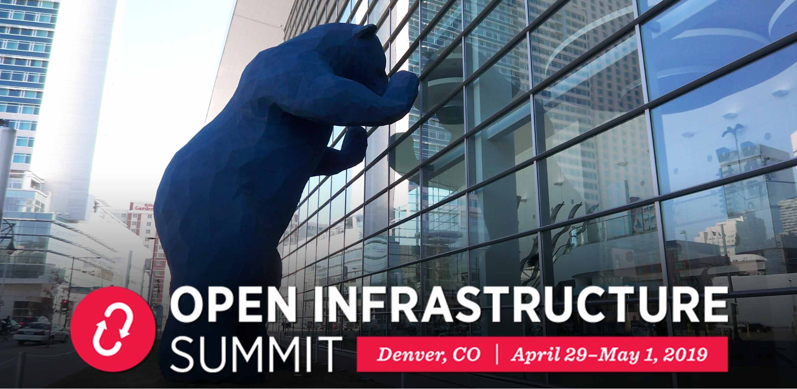
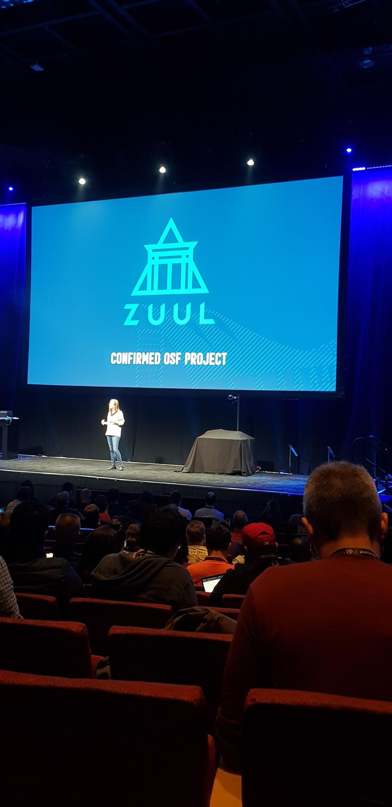
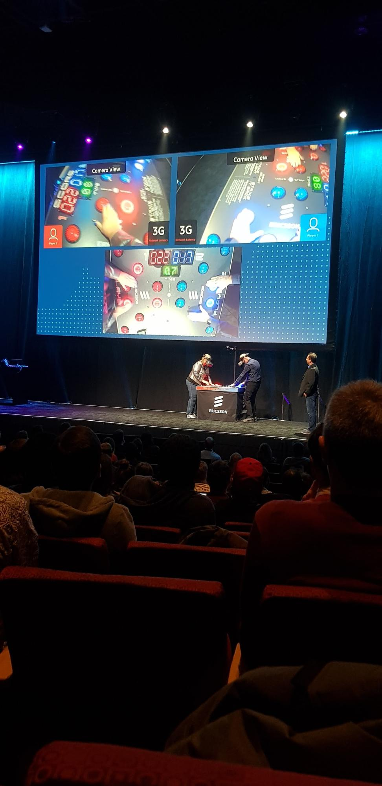

This is the very first OpenInfra Summit (prior is OpenStack Summit) and the general feeling is concentrated. It is also the intention of the organisers to have a smaller event than OpenStack Summit 2016 at Austin with almost 8000 attendants and about 400 people bigger than PTG event. The prior OpenStack Summit seemed too large that creates a lot of distractions and this event size allows for more collaborating among OpenStackers. It is also possible that the Summit was held in the US so that travelling was quite difficult therefore in order to compensate for the number of people who can not participate in the event, many local events will be organised by local OpenInfra UserGroups such as UK, Australia, and the upcoming OpenInfra Days event in Vietnam. The next Summit will be held in China that could be bigger because of the large communities and wide use cases.

OpenStack has developed simultaneously with current cloud technologies, not only virtual machine but also bare metal, GPU, etc. Ironic project was developed and fast applied along with using GPUs, bare metal in data center. Especially in this event, Kata and Zuul are announced as the first two OpenInfra projects (top level?) of the foundation. Along with affirming the stability and completeness of the above two projects, it is the growth and sprint development momentum of the their developer communities. 

Expanding from scope of OpenStack to OpenInfra is observed in the many activities that help interoperation between OpenStack, other cloud platforms and container infrastructure. Project Airship becomes an important project. It integrates many different open projects, OpenStack services, K8s, networks, bare metal, etc. It is being used in the production system of AT&T. Besides, the interoperation between hybrid cloud platform and containers is also a new trend in the event with many demos from Cisco and Verizon. The current OpenStack Searchlight project with 3 members from Vietnam OpenInfra community has joined in sharing a new development direction to serve the multi-cloud movement and it got encouragements of many experts from Cisco, Open Suse and Glance core contributors. . The team's goal is to add more contributors to complete the demo in the next Summit in China.

Open source plays a big role in many of the current 5G deployments, including many OpenStack products. 5G must support bunch of new data services, not only voice but video streaming, auto driving, drones, tele medicine, etc. Many of OpenStack projects have been developed to serve new technology applications that make them selected in telco's 5G tournaments. At this event AT&T again demonstrated the role of OpenStack products with low latency demo VR games over 5G networks.

To be continued ...
